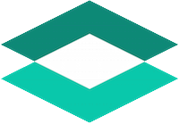

# Boveda-Lens: AI-Powered Patient Record Digitization

<p align="center"\>

</p\>

<p align="center">
  
  
  
  
  
</p>

**Boveda-Lens** is a full-stack monorepo application designed to streamline the digitization of military medical records from PDF documents. It leverages the Google Gemini API to perform multimodal data extraction, including OCR for handwritten text. The extracted information is then populated into a modern Angular interface where it can be reviewed, edited, and saved to a cloud-based PostgreSQL database.

## Key Features

- **AI-Powered Data Extraction**: Upload a patient's medical PDF, and the application's backend uses the Google Gemini API to intelligently parse and structure the data into a JSON format.
- **AI Model Selector**: Choose the best AI model for the job ("Fast," "Reliable," or "Accurate") to balance speed, cost, and precision for each document.
- **Document Type Selector**: Specify whether the document is for a "Military Personnel" or a "Sponsored Dependent" to ensure the AI correctly assigns military-specific information.
- **Comprehensive CRUD Functionality**: A robust and intuitive interface for Creating, Reading, Updating, and Deleting patient records.
- **Interactive Patient List**: View all patients in a clean, paginated table with controls for searching, sorting, and filtering.
- **Detailed Patient View**: Click on any patient to see a detailed, card-based layout of their demographic, sponsor, and medical encounter information.
- **Full Edit Capability**: An "edit mode" allows for the correction and amendment of any data extracted by the AI before it's saved.
- **Bulk Actions**: Select multiple patients from the list to perform bulk operations, such as deleting records.

## Technology Stack

- **Frontend (Angular)**:
  - [Angular](https://angular.io/) (v20+) with Standalone Components.
  - [Tailwind CSS](https://tailwindcss.com/) for modern styling.
  - TypeScript for all client-side logic.

* **Backend**:
  - [NestJS](https://nestjs.com/) (TypeScript) for a scalable and maintainable server-side architecture.
  - [TypeORM](https://typeorm.io/) for object-relational mapping.
  - **AI**: Google Gemini API (`gemini-2.5-flash`).
* **Database**:
  - PostgreSQL, hosted on [Neon](https://neon.tech/) (Serverless Postgres).
* **Development Environment**:
  - Node.js & npm Workspaces (Monorepo)

## Getting Started

Follow these instructions to get the project running on your local machine for development and testing.

### Prerequisites

- [Node.js](https://nodejs.org/) (v18 or higher).

* [Angular CLI](https://angular.io/cli) installed globally: `npm install -g @angular/cli`.
* A Google Gemini API Key.
* A connection URL from a Neon PostgreSQL database.

### 1\. Clone the Repository

```bash
git clone https://github.com/your-username/boveda-lens.git
cd boveda-lens
```

### 2\. Configure Environment Variables

1. Navigate to the backend directory.

2. Create a new file named .env.

3. Add the following configuration. Be sure to replace the placeholders with your actual credentials.

   ```env
   # Neon PostgreSQL Database Connection URL
   DATABASE_URL=your_neon_database_connection_url

   # Google Gemini API Key
   GEMINI_API_KEY=your_google_gemini_api_key

   # JWT Secret for Authentication
   JWT_SECRET=your_super_secret_key
   ```

### 3\. Install Dependencies

From the root of the project, install all dependencies for both the frontend and backend workspaces.

```bash
cd backend
npm run install:all
```

### 4\. Run the Application

The project is a monorepo containing two separate applications. You will need to run them in two separate terminals from the project root.

#### Start the Backend (NestJS)

```bash
# In your first terminal, from the project root:
npm run start:backend
```

The backend API will be running at [http://localhost:3000](http://localhost:3000).

#### Start the Frontend (Angular)

```bash
# In your second terminal, from the project root:
npm run start:frontend
```

The Angular frontend will be running and accessible at [http://localhost:4200](http://localhost:4200).

## API Endpoints

The backend exposes the following RESTful API endpoints for managing patient records:

- **`POST /api/extraction/upload`**: Uploads a PDF file for AI data extraction.
- **`GET /api/patients/stats`**: Retrieves dashboard statistics.
- **`POST /api/auth/login`**: Authenticates a user and returns a JWT.
- **`GET /api/patients`**: Retrieves a paginated, searchable, and sortable list of all patients.
- **`GET /api/patients/:id`**: Retrieves a single patient by their unique ID.
- **`POST /api/patients`**: Creates a new patient record in the database.
- **`PATCH /api/patients/:id`**: Updates an existing patient record.
- **`DELETE /api/patients/:id`**: Deletes a patient record.
