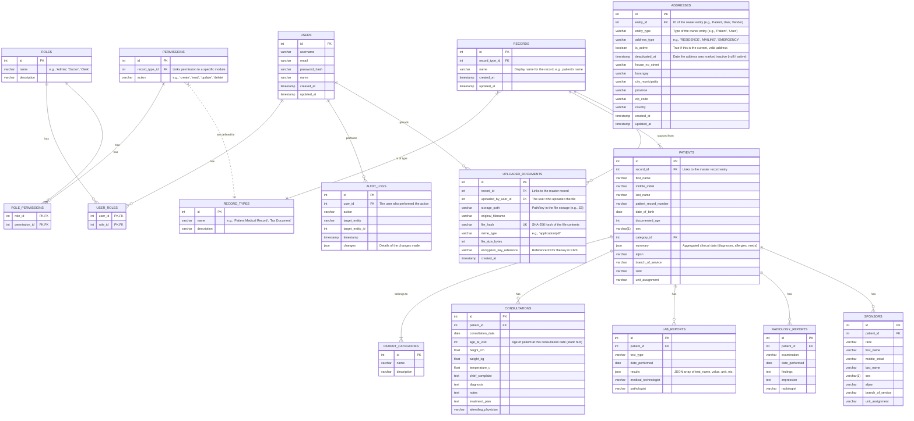

```mermaid

erDiagram
    USERS ||--o{ USER_ROLES : "has"
    ROLES ||--o{ USER_ROLES : "has"
    ROLES ||--o{ ROLE_PERMISSIONS : "has"
    PERMISSIONS ||--o{ ROLE_PERMISSIONS : "has"

    PERMISSIONS }|..|| RECORD_TYPES : "are defined for"
    RECORDS }|--|| RECORD_TYPES : "is of type"

    RECORDS ||--|{ PATIENTS : "is a"
    PATIENTS ||--|{ PATIENT_CATEGORIES : "belongs to"
    PATIENTS ||--o{ CONSULTATIONS : "has"
    PATIENTS ||--o{ LAB_REPORTS : "has"
    PATIENTS ||--o{ RADIOLOGY_REPORTS : "has"
    PATIENTS ||--o{ SPONSORS : "has"

    USERS ||--o{ AUDIT_LOGS : "performs"

    RECORDS ||--o{ UPLOADED_DOCUMENTS : "sourced from"
    USERS ||--o{ UPLOADED_DOCUMENTS : "uploads"


    USERS {
        int id PK
        varchar username
        varchar email
        varchar password_hash
        varchar name
        timestamp created_at
        timestamp updated_at
    }

    RECORDS {
        int id PK
        int record_type_id FK
        varchar name "Display name for the record, e.g., patient's name"
        timestamp created_at
        timestamp updated_at
    }

    RECORD_TYPES {
        int id PK
        varchar name "e.g., 'Patient Medical Record', 'Tax Document'"
        varchar description
    }

    UPLOADED_DOCUMENTS {
        int id PK
        int record_id FK "Links to the master record"
        int uploaded_by_user_id FK "The user who uploaded the file"
        varchar storage_path "Path/key in the file storage (e.g., S3)"
        varchar original_filename
        varchar file_hash UK "SHA-256 hash of the file contents"
        varchar mime_type "e.g., 'application/pdf'"
        int file_size_bytes
        varchar encryption_key_reference "Reference ID for the key in KMS"
        timestamp created_at
    }

    PATIENTS {
        int id PK
        int record_id FK "Links to the master record entry"
        varchar first_name
        varchar middle_initial
        varchar last_name
        varchar patient_record_number
        date date_of_birth
        int documented_age
        varchar(1) sex
        int category_id FK
        json summary "Aggregated clinical data (diagnoses, allergies, meds)"
        varchar afpsn
        varchar branch_of_service
        varchar rank
        varchar unit_assignment
    }

    ADDRESSES {
        int id PK
        int entity_id FK "ID of the owner entity (e.g., Patient, User, Vendor)"
        varchar entity_type "Type of the owner entity (e.g., 'Patient', 'User')"
        varchar address_type "e.g., 'RESIDENCE', 'MAILING', 'EMERGENCY'"
        boolean is_active "True if this is the current, valid address"
        timestamp deactivated_at "Date the address was marked inactive (null if active)"
        varchar house_no_street
        varchar barangay
        varchar city_municipality
        varchar province
        varchar zip_code
        varchar country
        timestamp created_at
        timestamp updated_at
    }

    PATIENT_CATEGORIES {
        int id PK
        varchar name
        varchar description
    }

    SPONSORS {
        int id PK
        int patient_id FK
        varchar rank
        varchar first_name
        varchar middle_initial
        varchar last_name
        varchar(1) sex
        varchar afpsn
        varchar branch_of_service
        varchar unit_assignment
    }

    CONSULTATIONS {
        int id PK
        int patient_id FK
        date consultation_date
        int age_at_visit "Age of patient at this consultation date (static fact)"
        float height_cm
        float weight_kg
        float temperature_c
        text chief_complaint
        text diagnosis
        text notes
        text treatment_plan
        varchar attending_physician
    }

    LAB_REPORTS {
        int id PK
        int patient_id FK
        varchar test_type
        date date_performed
        json results "JSON array of test_name, value, unit, etc."
        varchar medical_technologist
        varchar pathologist
    }

    RADIOLOGY_REPORTS {
        int id PK
        int patient_id FK
        varchar examination
        date date_performed
        text findings
        text impression
        varchar radiologist
    }

    ROLES {
        int id PK
        varchar name "e.g., 'Admin', 'Doctor', 'Clerk'"
        varchar description
    }

    PERMISSIONS {
        int id PK
        int record_type_id FK "Links permission to a specific module"
        varchar action "e.g., 'create', 'read', 'update', 'delete'"
    }

    USER_ROLES {
        int user_id PK, FK
        int role_id PK, FK
    }

    ROLE_PERMISSIONS {
        int role_id PK, FK
        int permission_id PK, FK
    }

    AUDIT_LOGS {
        int id PK
        int user_id FK "The user who performed the action"
        varchar action
        varchar target_entity
        int target_entity_id
        timestamp timestamp
        json changes "Details of the changes made"
    }

```
